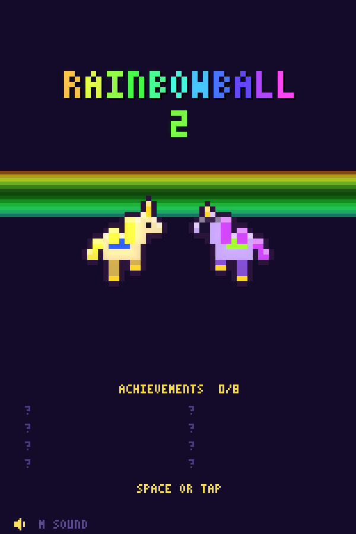
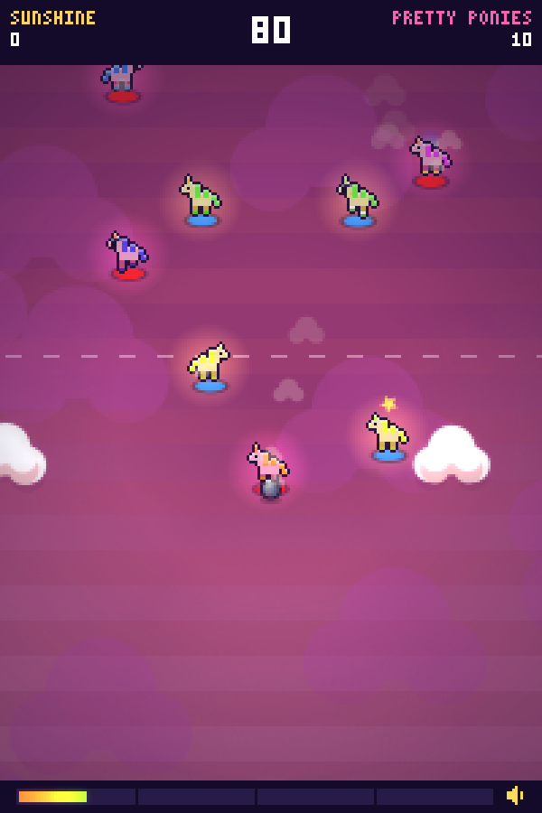
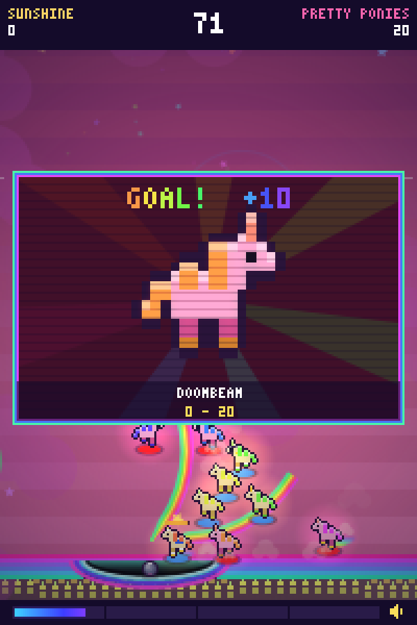
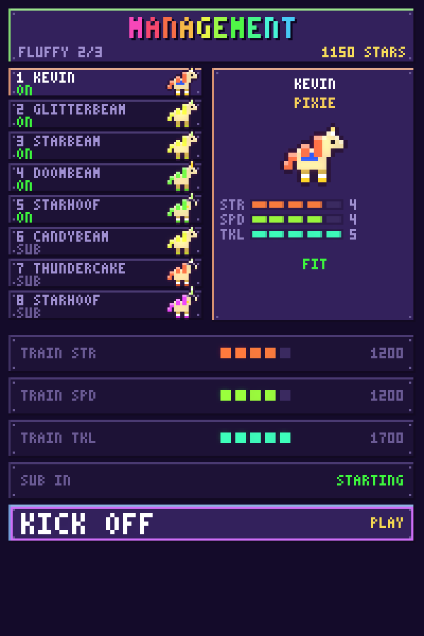

# RAINBOWBALL 2: BRUTAL UNICORNS

A js13k entry: a Speedball 2-inspired future sport played by small aggressive
unicorns on a rainbow pitch. One HTML file under 13,312 bytes zipped, with no image, audio or font
assets: every pixel, note, name and arena is generated from code at runtime.

    npm install
    npm run dev      # writes dev.html; open it in a browser, breakpoints land in real files
    npm run size     # per-module byte report
    npm run pack     # Terser + Roadroller + zip + advzip, checked against 13,312
    npm test         # headless: play a match under node-canvas, walk every screen, check text fits
    npm run shots    # rewrite screenshots/*.png from the packed build

The packed entry is `dist/index.html`; `dist/game.zip` is the submission.
`advzip` (from advancecomp, `brew install advancecomp`) is optional but worth
about 430 bytes; the build says which zipper it used.

## Screenshots

| | |
|---|---|
|  |  |
| **Title.** Every glyph comes from a 3x5 pixel font packed as octal digits. | **Open play.** 5v5 on a generated pitch that scrolls on both axes. |
|  |  |
| **Goal camera.** Cuts to whoever touched the ball last, own goals included. | **The desk.** Between matches: who is fit, what a stat point costs, kick off. |

## How to play

Keyboard: arrows or WASD move, space tackles without the ball and shoots with
it, `R` fires a rainbow rail, `M` toggles sound. Touch: drag the left half of
the screen to move, tap the right half to tackle or shoot, tap RAIL for a rail.
The first kickoff shows a card with whichever set applies.

Scoring: a goal is ten points, putting an opponent in the
ambulance is ten, and every star you have lit down the side rails adds one to
both. Seven stars run down each side rail, fourteen in all, so a goal can be
worth 24. Stars are contested: hit one the other side lit and it is yours. Own
all seven on either side and the pitch goes full spectrum for twenty seconds:
your rails free and twice as long-lived, the surface cycling through the wheel.

Rainbow rails are curved walls the ball banks off at steep angles and rides at
shallow ones. They belong to nobody, cost 25 of the rail meter (the bar at the
bottom, filled by playing rough), and a ball that rides a whole one splits into
two scoring ghosts at the far end. Shots have height: a hard one clears the
studs and sails over heads, and a rail fired under it lifts it further.

Every unicorn has three stats, STR (launch power), SPD (running speed) and TKL
(winning tackles and resisting them), generated 0 to 5 and trainable to 8 on
the desk. A trained unicorn looks trained: STR gilds the horn, SPD the hooves,
TKL adds a band on the flank. Each also has an energy bar; empty it and the
medics stretcher them off, which is a point to the other side and a one-match
injury, and a reserve comes on. A side with nobody left loses on the spot.

A season is four divisions of three matches each; win two of three to go up,
otherwise you play the division again. The last match is always against DEATH
RAINBOWS, who lay rails wherever they run. Arenas are generated from one
integer: name, palette, length, goal width, layout, hazards (electrified studs,
sliding studs, ice that carries the ball and the unicorns), night matches, and
in the top division sometimes a sky pitch with no side walls. Eight achievements
are kept in local storage and shown on the title screen.

## How it is built

Store rules, shapes and palettes, never finished graphics. One `unicorn()`
function of about fifteen rectangles draws every player; a team is one hue and
everything derives from it. The sprite is drawn into a 24x24 offscreen canvas
and lit by two compositing rules, a one-pixel rim and a top light, so every
pose gets an outline for free. Two trackers of three voices each, patterns as
digit strings, give the menus and the match their tunes.

`src/*.js` are concatenated in filename order into one scope: no bundler, no
imports. The numbering is the load order and it matters, because top-level
`const`s initialise in sequence.

    00_boot        canvas and context
    10_core        colour, rect, clamp, PRNG
    12_font        3x5 pixel font, five octal digits per glyph
    14_audio       oscillator blips
    16_music       two three-voice trackers
    20_data        teams, archetypes, stat costs, arena generator
    30_state       all mutable game state
    32_squad       squad, stats, injuries, match setup
    40_fx          particles
    50_unicorn     the sprite
    52_arena       pitch, goals, studs, stands, star bank
    60_input       keys, pointer, menus, training
    70_sim         derived stats, shooting, tackling, energy, medics
    74_rainbows    rails: geometry the ball reacts to
    76_ai          opponent logic, sharpened by division
    78_players     player integration and collision
    79_ball        ball physics, goals, star bank, scoring
    80_draw        ball, players, particles, goal camera, HUD
    82_screens     title, the desk, results
    90_loop        fixed-step loop and render

The build is deterministic: `tools/heatmap-params.json` freezes the Roadroller
parameters, so two packs of the same source give the same byte.

## License

Apache License 2.0, see [LICENSE](LICENSE). Copyright 2026 Raimon Ràfols.
